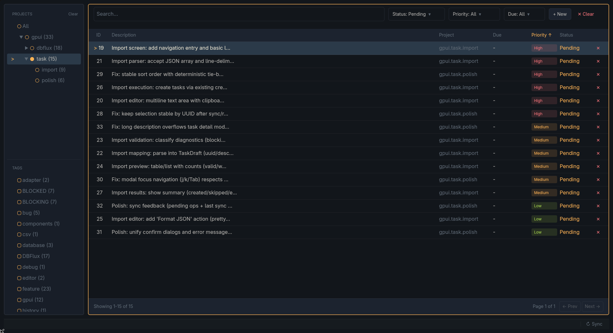

# Task Warrior GPUI



Una GUI de escritorio para [TaskWarrior](https://taskwarrior.org/) construida con [GPUI](https://gpui.rs/), el framework de UI acelerado por GPU de Zed.

## Características

### Gestión de Tareas
- **Crear, Editar, Eliminar**: Operaciones CRUD completas con atajos de teclado y soporte para mouse
- **Ver Detalles de la Tarea**: Vista modal enriquecida con información completa de la tarea y metadatos
- **Anotaciones**: Añadir, editar, copiar y eliminar anotaciones con retroalimentación visual
- **Autocompletado Inteligente**: Sugerencias de proyectos jerárquicos y filtrado de etiquetas

### Navegación y Filtrado
- **Árbol de Proyectos**: Vista de árbol colapsable con conteo de tareas y navegación por teclado
- **Filtrado por Etiquetas**: Filtrado de etiquetas con selección múltiple y conteo de tareas
- **Filtros Avanzados**: Filtrar por estado, prioridad, fecha de vencimiento y texto de búsqueda
- **Tabla Ordenable**: Haz clic en los encabezados o usa el teclado para ordenar por cualquier columna

### Diseño Orientado al Teclado
- **Navegación Completa por Teclado**: Navega por toda la interfaz sin tocar el mouse
- **Atajos Contextuales**: Diferentes atajos según el contexto (tabla, modal, filtros)
- **Vínculos tipo Vim**: Navegación con `j`/`k`, `h`/`l` para movimiento horizontal
- **Modo de Edición Modal**: Flujo de trabajo completo por teclado para editar con soporte para deshacer/rehacer

### Pulido Visual
- **Tema Oscuro**: Esquema de colores inspirado en Ayu optimizado para la legibilidad
- **Notificaciones Toast**: Retroalimentación no intrusiva para las acciones
- **Desplazamiento Fluido**: Renderizado acelerado por GPU para un rendimiento sumamente fluido
- **Paginación**: Navega por listas grandes de tareas de manera eficiente

## Requisitos

- Rust (edición 2024)
- TaskWarrior instalado y configurado

## Instalación

```bash
# Clonar el repositorio
git clone https://github.com/0xErwin1/taskwarrior-gpui.git
cd taskwarrior-gpui

# Opción 1: Ejecutar directamente
cargo run --release

# Opción 2: Instalar globalmente
cargo install --path .
```

La aplicación utilizará tu directorio de datos existente de TaskWarrior.

## Inicio Rápido

### Atajos de Teclado

| Acción | Atajo |
|--------|----------|
| Crear tarea | `c` |
| Editar tarea | `e` |
| Eliminar tarea | `Delete` |
| Ver tarea | `Enter` |
| Navegar | `j`/`k` o teclas de flecha |
| Enfocar búsqueda | `Ctrl+F` |
| Sincronizar tareas | `Ctrl+R` |
| Cerrar modal | `Escape` |

Para una lista completa de atajos de teclado, consulta [docs/keyboard-shortcuts.md](docs/keyboard-shortcuts.md).

### Flujo de Trabajo Básico

1. **Ver Tareas**: Las tareas se muestran en la tabla principal con opciones de filtrado en la parte superior
2. **Crear Tarea**: Presiona `c` o haz clic en el botón "+ New", completa los detalles y guarda con `Ctrl+S`
3. **Editar Tarea**: Selecciona una tarea y presiona `e`, o haz doble clic para verla y luego presiona `e`
4. **Filtrar**: Usa la barra lateral para filtrar por proyecto/etiqueta, o usa la barra de filtros para más opciones
5. **Sincronizar**: Presiona `Ctrl+R` para sincronizar los cambios con TaskWarrior

## Documentación

- [Keyboard Shortcuts](docs/keyboard-shortcuts.md) - Referencia completa de atajos de teclado
- [Keymap Guide](docs/keymap.md) - Comprensión del sistema de mapeo de teclas y cómo añadir vínculos personalizados

## Licencia

MIT OR Apache-2.0
