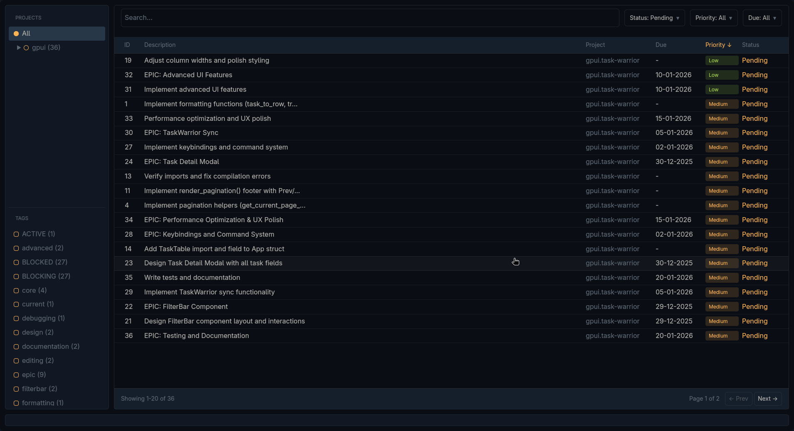

# Task Warrior GPUI



A desktop GUI for [TaskWarrior](https://taskwarrior.org/) built with [GPUI](https://gpui.rs/), the GPU-accelerated UI framework from Zed.

## Features

- View and filter tasks by project, status, priority, and due date
- Project tree with task counts
- Tag filtering with multi-select
- Sortable task table with pagination
- Dark theme (Ayu-inspired)

## Requirements

- Rust (2024 edition)
- TaskWarrior installed and configured

## Installation

```bash
# Clone the repository
git clone https://github.com/0xErwin1/taskwarrior-gpui.git
cd taskwarrior-gpui

# Option 1: Run directly
cargo run --release

# Option 2: Install globally
cargo install --path .
```

The application will use your existing TaskWarrior data directory.

## License

MIT OR Apache-2.0
